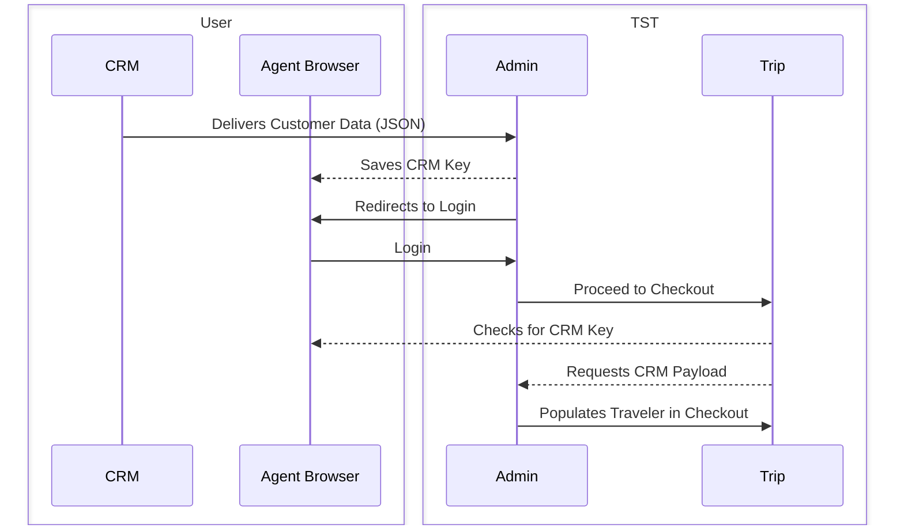

# MRM/CRM Integration


### Workflow
The workflow for communicating with the TST MRM/CRM Service is as follows:



### Data Format

```json lines
{
    'profiles': [
        {
        'firstName': '',
        'lastName': '',
        'middleName':'',
        'emailAddress':'',
        'phone':'XXX-XXX-XXXX',
        'membership':'',
        'addressLine1':'',
        'addressLine2':'',
        'city':'',
        'state':'',
        'zipCode':'',
        'countryCode': 'ISO 3166-1 valid Country Code',
        'dateOfBirth': 'MM/dd/yyyy',
        'gender': 'M or F',
        'title': 'Mr,Ms,Mrs,Miss,Mstr,Dr',
        'suffix': 'Jr,Sr,I,II,III,IV ,V,VI,VII,VIII,IX,X',
        'travellerId': 'Custom Unique TravellerID'
        },
        {
        'firstName': '',
        'lastName': '',
        'middleName':'',
        'emailAddress':'',
        'phone':'XXX-XXX-XXXX',
        'membership':'',
        'addressLine1':'',
        'addressLine2':'',
        'city':'',
        'state':'',
        'zipCode':'',
        'countryCode': 'ISO 3166-1 valid Country Code',
        'dateOfBirth': 'MM/dd/yyyy',
        'gender': 'M or F',
        'title': 'Mr,Ms,Mrs,Miss,Mstr,Dr',
        'suffix': 'Jr,Sr,I,II,III,IV ,V,VI,VII,VIII,IX,X',
        'travellerId': 'Custom Unique TravellerID'
        }
    ],
    echo: {
        'customField1': '',
        'customField2': '',
        'customFieldN': ''
    },
    target: '<redirect url>'
}
```

### Example Scripts

```Ruby
require 'net/http'
require 'net/https'
require 'json'
 
if ARGV.length != 1
    puts "Usage: mrm.rb <hostname>"
    exit 1
end
  
host, *rest = ARGV
 
payload={
    'profiles' => [
        {
        'firstName' => 'Joe', 
        'lastName' => 'Earthworm',
        'middleName' => 'K',
        'emailAddress' => 'JoeEarthworm@domain.bom',
        'phone' => '444-333-2222',
        'membership' => '1234567890123456',
        'addressLine1' => '1313 Shadowbrook Ln',
        'addressLine2' => 'Suite 300',
        'city' => 'Alpharetta',
        'state' => 'GA',
        'zipCode' => '30004',
        'countryCode': 'US',
        'dateOfBirth': '11/01/1980',
        'gender': 'M',
        'title': 'Mr',
        'suffix': 'III',
        'travellerId': 'abcde-abcde-lkjhg-lkjhg'
        },
        {
        'firstName' => 'John', 
        'lastName' => 'Earthworm',
        'middleName' => 'A',
        'emailAddress' => 'JohnEarthworm@domain.bom',
        'phone' => '222-333-2222',
        'membership' => '234567890123456',
        'addressLine1' => '1322 Shadowbrook Ln',
        'addressLine2' => 'Suite 400',
        'city' => 'Alpharetta',
        'state' => 'GA',
        'zipCode' => '30005',
        'countryCode': 'US',
        'dateOfBirth': '03/25/1980',
        'gender': 'M'
        },
        {
        'firstName' => 'Jean',
        'lastName' => 'Earthworm'
        }
    ],
    'echo' => {
        'marketCode' => 'abc',
        'leadSource' => 'John Doe'
    },
    'target' => 'https://amatravel.localhost/car'
}.to_json
 
uri = URI.parse('https://' + host + '/admin/integration/acceptProfiles')
req = Net::HTTP::Post.new(uri, initheader = {'Content-Type' =>'application/json'})
req.body = payload
res = Net::HTTP.start(
    uri.hostname, uri.port,
    :use_ssl => uri.scheme == 'https',
    :verify_mode => OpenSSL::SSL::VERIFY_NONE) do |http|
  http.request(req)
end
redirect_uri = 'https://' + host + res.header['location']
cmd = 'open -a "Google Chrome" ' +  redirect_uri
exec cmd
```

### Postman Collections


### Direct CRM Client Behavior
When sending the initial POST of traveller data to the `https://<host>/admin/integration/acceptProfiles` we require a valid authentication cookie in order to redirect the browser to the requested target.

When sending this POST via a CRM client, you may not have access to the browsers cookies to do this and so the agent will be required to log in again after every CRM import. As a workaround for this we provide an unauthenticated endpoint: `/admin/integration/createMrmProfile`

The createMrmProfile endpoint is a drop-in replacement for acceptProfiles except it will not redirect the user since it is designed to be called from a CRM client and not a web-browser. This call will return a UUID that can be used to construct a second endpoint that can be passed to a web-browser to finalize the import.

Steps
1. Send the CRM data via POST with the same schema as `/admin/integration/acceptProfiles` except change the path to:
`/admin/integration/createMrmProfile` (This endpoint doesn't require a browser cookie and so is OK to send via a desktop application)
2. If successful you will receive a 200 response with a `[<GUID>]` in the response body:
`[775a5b5f-xxxx-xxxx-xxxx-7072674bc15b]`
3. Use the GUID to construct a url with this format while ensuring to URL Encode the brackets: `https://{\{hostname}}/admin/integration/attachProfiles/<guid>`

Example

`https://<hostname>/admin/integration/attachProfiles/%5B775a5b5f-xxxx-xxxx-xxxx-7072674bc15b%5D`

Use this URL as the target for the client's web-browser. This will attach the CRM traveller data to the client's session and redirect to the target url.