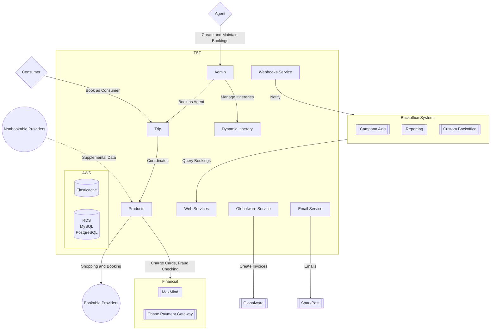

# TST Architecture (Mermaid-Flowchart)

```mermaid
flowchart TB
  Agent{Agent}
  Consumer{Consumer}
  subgraph Backoffice [Backoffice Systems]
      direction TB
      CampanaAXIS[["Campana Axis"]]
      Reporting[["Reporting"]]
      CustomBackoffice[["Custom Backoffice"]]
  end
  Globalware[["Globalware"]]

  BookableProviders(("Bookable Providers"))
  NonbookableProviders(("Nonbookable Providers"))

  SparkPost[["SparkPost"]]
  subgraph Financial
    MaxMind[["MaxMind"]]
    Chase[["Chase Payment Gateway"]]
  end
  
  subgraph TST [TST]
    direction TB
    subgraph AWS
        Elasticache[(Elasticache)]
        RDS[("`RDS 
        MySQL
        PostgreSQL`")]
    end
    Trip
    DynamicItinerary["Dynamic Itinerary"]
    Products
    Admin
    WebServices["Web Services"]
    Webhooks["Webhooks Service"]
    GlobalwareService["Globalware Service"]
    EmailService["Email Service"]
  end

  Backoffice-->|Query Bookings|WebServices
  Webhooks-->|Notify|Backoffice
%%  Webhooks-->|Notify|GlobalwareService
  GlobalwareService-->|Create Invoices|Globalware
  
%%  DynamicItinerary-->|Add Itinerary Planning|Trip
  Trip-->|Coordinates|Products
  EmailService-->|Emails|SparkPost
  Products-->|Charge Cards, Fraud Checking|Financial
  
  Admin-->|Book as Agent|Trip
  Consumer-->|Book as Consumer|Trip
  Admin-->|Manage Itineraries|DynamicItinerary
  
  Agent-->|Create and Maintain Bookings|Admin
  
  Products-->|Shopping and Booking|BookableProviders
  NonbookableProviders-.->|Supplemental Data|Products
```