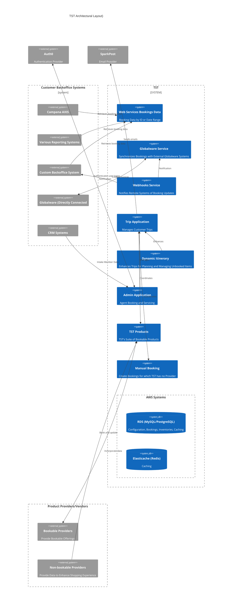

# TST Architecture (Mermaid)

```mermaid
C4Context
      title TST Architectural Layout)
    
    System_Ext(Auth0, "Auth0", "Authentication Provider")
    System_Ext(SparkPost, "SparkPost", "Email Provider")
    
    Boundary(CustomerBackoffice, "Customer Backoffice Systems") {
    System_Ext(Campana, "Campana AXIS")
    System_Ext(Reporting, "Various Reporting Systems")
    System_Ext(CustomBackoffice, "Custom Backoffice System")
    System_Ext(GlobalwareDirect, "Globalware (Directly Connected")
    System_Ext(CRM, "CRM Systems")
    }
    
    System_Boundary(TST, "TST") {
    System(WebServicesBookings, "Web Services Bookings Data", "Booking Data by ID or Date Range")
    System(GlobalwareService, "Globalware Service", "Synchronizes Bookings with External Globalware Systems")
    System(WebhookService, "Webhooks Service", "Notifies Remote Systems of Booking Updates")
    System(Trip, "Trip Application", "Manages Customer Trips")
    System(DynamicItinerary, "Dynamic Itinerary", "Enhances Trips for Planning and Managing Unbooked Items")
    System(Admin, "Admin Application", "Agent Booking and Servicing")
    System(TSTProducts, "TST Products", "TST's Suite of Bookable Products")
    System(ManualBooking, "Manual Booking", "Create Bookings for which TST has no Provider")
    Boundary(AWS, "AWS Systems", "") {
    SystemDb(TSTMySQL, "RDS (MySQL/PostgreSQL)", "Configuration, Bookings, Inventories, Caching")
    SystemDb(TSTRedis, "Elasticache (Redis)", "Caching")
    }
        }
    
    
    Boundary(Providers, "Product Providers/Vendors", "") {
    System_Ext(BookableProviders, "Bookable Providers", "Provide Bookable Offerings")
    System_Ext(NonBookableProviders, "Non-bookable Providers", "Provide Data to Enhance Shopping Experience")
    }
    
    BiRel(Auth0, Admin, "Authenticates user logins")
    Rel(CRM, Admin, "Intake Member Data")
    
    Rel(WebhookService, CustomBackoffice, "Notification")
    Rel(WebhookService, GlobalwareService, "Notification")
    Rel(CustomBackoffice, WebServicesBookings, "Retrieves booking data")
    Rel(Campana, WebServicesBookings, "Retrieves booking data")
    Rel(Reporting, WebServicesBookings, "Retrieves booking data")
    BiRel(GlobalwareService, GlobalwareDirect, "Creates invoices")
    
    BiRel(Trip, TSTProducts, "Coordinates")
    BiRel(Trip, ManualBooking, "Coordinates")
    Rel(DynamicItinerary, Trip, "Enhances")
    Rel(Admin, Trip, "Manages")
    Rel(Trip, SparkPost, "Sends emails")
    
    BiRel(TSTProducts, BookableProviders, "Book and update")
    Rel(NonBookableProviders, TSTProducts, "Incorporate data")
```